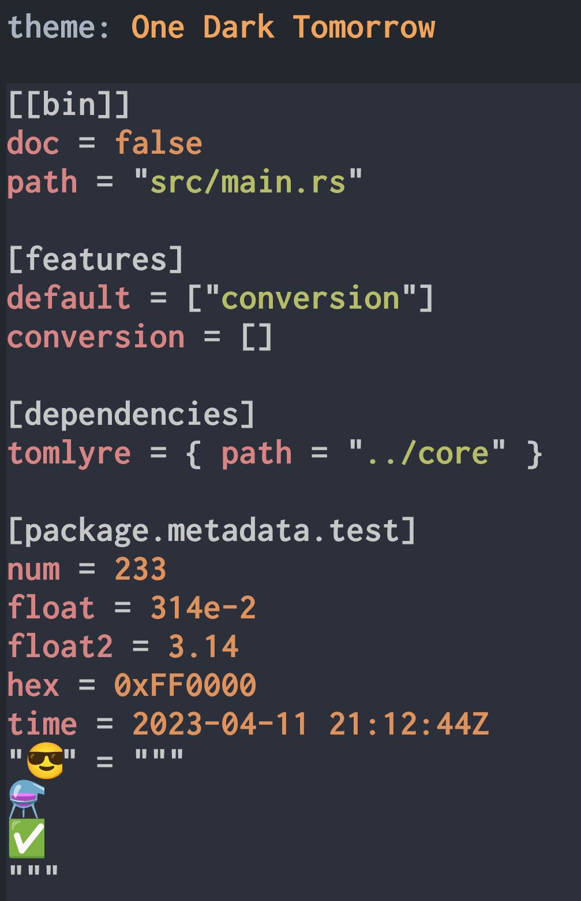

# TomLyre

一款用于处理配置文件的小工具。

您可以用它来自由探索 toml、yaml、json、ron、bson、Lisp S-exp 以及 xml，并从中发现乐趣。

> 默认情况下，没有启用 bson 和 xml 功能。

## 安装


先单击打开 svg 图片，然后对蓝色高亮的超链接处（例如 “arm64.deb”）按下鼠标中键。  
如果没有鼠标的话，可以长按触摸屏，手动选择“在新标签页中打开”，这样子就可以下载了。

上面那张 svg 会自动更新，如果因为浏览器缓存而导致无法获取最新的 svg，则请前往 releases 获取固定版本的 svg。

### ubuntu

对于 **ubuntu**，我们可以直接用 `apt install [deb文件的路径]` 来安装。

> 如果没有 root 权限，则需要用 `sudo` 或 `doas` 之类的提权命令。

假设 deb 文件的路径为 `/app.deb`, 那么安装命令就是 `apt install /app.deb`

<table>
  <tr>
    <td></td>
    <td></td>
  </tr>
</table>

### alpine

让我们来试试 alpine 能不能安装 deb 吧！

<table>
  <tr>
    <td></td>
    <td></td>
  </tr>
</table>

它是 `musl-linux-riscv64`，而不是 `riscv64`, 看起来好像不能安装的样子咦？

让我们来强制安装看看。

<table>
  <tr>
    <td></td>
    <td></td>
  </tr>
</table>

> Q: 喔哦! 真是太不可思议了！为什么它不仅可以装上去，而且还能跑呢？

A: 因为它是静态编译的。

> 有时候 glibc 的静态链接可能会出问题，建议用 musl。

考虑到不同发行版的包管理器可能会冲突，因此建议在 alpine 上使用 alpine 自家的 `apk`， 而不是 debian 的 `dpkg`。

<table>
  <tr>
    <td></td>
    <td>您可以把它拆出来用</td>
  </tr>
</table>

### wasm

<table>
  <tr>
    <td></td>
    <td></td>
  </tr>
</table>

下载完 `wasm.zst` 文件后，需要将其解压出来。

接着需要获取 runtime，然后让 runtime 来加载这个 wasm 文件。

比方说，您可以用 `wasmer`:

```sh
wasmer --dir . --env LANG=zh ./tomlyre.wasm
```

也可以用 `wasmtime`:

```sh
wasmtime --dir . --env LANG=zh ./tomlyre.wasm
```

或者是其他您喜欢的 runtimes。

### CI

您如果需要在 Linux x64 的 CI 环境中使用它，则可使用以下命令

```sh
docker run -it --rm \
  -u $(id -u) \
  -v $PWD:/local \
  -w /data \
  ghcr.io/2moe/tomlyre:x86_64-unknown-linux-musl \
  cp tomlyre /local
```

这相当于把容器内部的 `/data/tomlyre` 复制到当前目录

### 其他

对于以 `tar.xz`/`tar.bz2` 为后缀的文件，我们可以使用 `tar -xvf [压缩包]` 来解压。

```sh
tar -xvf x64.tar.xz
```

解压完成后，在终端里调用 `./tomlyre` 即可。

## 功能

核心功能只有三个：

- 转换 (conv)
- 获取 (get)
- 设置/修改 (set)

除此之外，全都是额外的功能，例如设置主题与表格的样式。

使用 `--help` 能获取详细的帮助信息。

- `tomlyre set` 相当于 `tomlyre set -h` ，它会输出简洁的帮助信息。
- `tomlyre set --help` 会输出非常详细的信息。
- 同理，其他子命令也能调用 `--help`。

<!--  -->

<table>
  <tr>
    <td><p align="center"><code>set --help</code></p></td>
    <td><p align="center"><code>conv --help</code></p></td>
  </tr>
</table>

### 主题

使用 `--theme` 参数 (可以简写为 `-t`) 来指定主题，例如 `tomlyre -t "One Dark" conv test.yml -t json`。

> `conv` 子命令的 `-t` 指的是 `--to`，而根命令的 `-t` 则是 `--theme`。

当未指定主题名称时，会列举出所有的主题。

以下是内置的主题，您可以手动载入主题集合包，并指定名称，而不是使用内置的主题。

> 这些主题大都使用 MIT License，您可以在 **assets/theme** 目录下找到内置主题以及相关的许可证文件。

<table>
  <tr>
    <td></td>
    <td></td>
  </tr>
</table>

<table>
  <tr>
      <td></td>
      <td></td>
  </tr>
</table>

<table>
  <tr>
      <td></td>
      <td></td>
  </tr>
</table>

<table>
  <tr>
      <td></td>
      <td></td>
  </tr>
</table>

<table>
  <tr>
    <td></td>
    <td></td>
  </tr>
</table>

<table>
  <tr>
    <td></td>
    <td></td>
  </tr>
</table>

### 表格样式

使用 `--table-style` 来指定表格样式(可以简写为 `--ts`)，例如: `--table-style markdown` 或 `--ts md` 可以指定表格样式为 markdown。

```sh
tomlyre --ts md get Cargo.toml -k profile.fat
```

| profile.fat | 类型 | Value |
| ----------- | ---- | ----- |
| inherits    | str  | thin  |
| lto         | str  | fat   |
| opt-level   | str  | z     |

以下为内置的表格样式：
（非等宽字体可能会出现排版异常的问题）

```plaintext

style: default

╭─────────┬──────────┬────────────╮
│ Version ┆ Codename ┆ Created    │
├─────────┼──────────┼────────────┤
│ 10      ┆ Buster   ┆ 2017-06-17 │
├╌╌╌╌╌╌╌╌╌┼╌╌╌╌╌╌╌╌╌╌┼╌╌╌╌╌╌╌╌╌╌╌╌┤
│ 11      ┆ Bullseye ┆ 2019-07-16 │
├╌╌╌╌╌╌╌╌╌┼╌╌╌╌╌╌╌╌╌╌┼╌╌╌╌╌╌╌╌╌╌╌╌┤
│ 12      ┆ Bookworm ┆ 2021-08-14 │
├╌╌╌╌╌╌╌╌╌┼╌╌╌╌╌╌╌╌╌╌┼╌╌╌╌╌╌╌╌╌╌╌╌┤
│ 13      ┆ Trixie   ┆ 2023       │
├╌╌╌╌╌╌╌╌╌┼╌╌╌╌╌╌╌╌╌╌┼╌╌╌╌╌╌╌╌╌╌╌╌┤
│ 14      ┆ Forky    ┆ 2025       │
╰─────────┴──────────┴────────────╯


style: nothing

 Version  Codename  Created
 10       Buster    2017-06-17
 11       Bullseye  2019-07-16
 12       Bookworm  2021-08-14
 13       Trixie    2023
 14       Forky     2025


style: ascii

+---------+----------+------------+
| Version | Codename | Created    |
+=================================+
| 10      | Buster   | 2017-06-17 |
|---------+----------+------------|
| 11      | Bullseye | 2019-07-16 |
|---------+----------+------------|
| 12      | Bookworm | 2021-08-14 |
|---------+----------+------------|
| 13      | Trixie   | 2023       |
|---------+----------+------------|
| 14      | Forky    | 2025       |
+---------+----------+------------+


style: ascii-borders

+---------------------------------+
| Version   Codename   Created    |
+=================================+
| 10        Buster     2017-06-17 |
| 11        Bullseye   2019-07-16 |
| 12        Bookworm   2021-08-14 |
| 13        Trixie     2023       |
| 14        Forky      2025       |
+---------------------------------+


style: right-u8-fat

┌─────────┬──────────┬────────────┐
│ Version │ Codename │ Created    │
╞═════════╪══════════╪════════════╡
│ 10      │ Buster   │ 2017-06-17 │
├─────────┼──────────┼────────────┤
│ 11      │ Bullseye │ 2019-07-16 │
├─────────┼──────────┼────────────┤
│ 12      │ Bookworm │ 2021-08-14 │
├─────────┼──────────┼────────────┤
│ 13      │ Trixie   │ 2023       │
├─────────┼──────────┼────────────┤
│ 14      │ Forky    │ 2025       │
└─────────┴──────────┴────────────┘


style: right-u8

┌─────────┬──────────┬────────────┐
│ Version │ Codename │ Created    │
├─────────┼──────────┼────────────┤
│ 10      │ Buster   │ 2017-06-17 │
├─────────┼──────────┼────────────┤
│ 11      │ Bullseye │ 2019-07-16 │
├─────────┼──────────┼────────────┤
│ 12      │ Bookworm │ 2021-08-14 │
├─────────┼──────────┼────────────┤
│ 13      │ Trixie   │ 2023       │
├─────────┼──────────┼────────────┤
│ 14      │ Forky    │ 2025       │
└─────────┴──────────┴────────────┘


style: right-u8-thin

┌─────────┬──────────┬────────────┐
│ Version ┆ Codename ┆ Created    │
├─────────┼──────────┼────────────┤
│ 10      ┆ Buster   ┆ 2017-06-17 │
├╌╌╌╌╌╌╌╌╌┼╌╌╌╌╌╌╌╌╌╌┼╌╌╌╌╌╌╌╌╌╌╌╌┤
│ 11      ┆ Bullseye ┆ 2019-07-16 │
├╌╌╌╌╌╌╌╌╌┼╌╌╌╌╌╌╌╌╌╌┼╌╌╌╌╌╌╌╌╌╌╌╌┤
│ 12      ┆ Bookworm ┆ 2021-08-14 │
├╌╌╌╌╌╌╌╌╌┼╌╌╌╌╌╌╌╌╌╌┼╌╌╌╌╌╌╌╌╌╌╌╌┤
│ 13      ┆ Trixie   ┆ 2023       │
├╌╌╌╌╌╌╌╌╌┼╌╌╌╌╌╌╌╌╌╌┼╌╌╌╌╌╌╌╌╌╌╌╌┤
│ 14      ┆ Forky    ┆ 2025       │
└─────────┴──────────┴────────────┘


style: u8

┌─────────┬──────────┬────────────┐
│ Version ┆ Codename ┆ Created    │
╞═════════╪══════════╪════════════╡
│ 10      ┆ Buster   ┆ 2017-06-17 │
├╌╌╌╌╌╌╌╌╌┼╌╌╌╌╌╌╌╌╌╌┼╌╌╌╌╌╌╌╌╌╌╌╌┤
│ 11      ┆ Bullseye ┆ 2019-07-16 │
├╌╌╌╌╌╌╌╌╌┼╌╌╌╌╌╌╌╌╌╌┼╌╌╌╌╌╌╌╌╌╌╌╌┤
│ 12      ┆ Bookworm ┆ 2021-08-14 │
├╌╌╌╌╌╌╌╌╌┼╌╌╌╌╌╌╌╌╌╌┼╌╌╌╌╌╌╌╌╌╌╌╌┤
│ 13      ┆ Trixie   ┆ 2023       │
├╌╌╌╌╌╌╌╌╌┼╌╌╌╌╌╌╌╌╌╌┼╌╌╌╌╌╌╌╌╌╌╌╌┤
│ 14      ┆ Forky    ┆ 2025       │
└─────────┴──────────┴────────────┘


style: u8-no-dividers

┌─────────┬──────────┬────────────┐
│ Version ┆ Codename ┆ Created    │
╞═════════╪══════════╪════════════╡
│ 10      ┆ Buster   ┆ 2017-06-17 │
│ 11      ┆ Bullseye ┆ 2019-07-16 │
│ 12      ┆ Bookworm ┆ 2021-08-14 │
│ 13      ┆ Trixie   ┆ 2023       │
│ 14      ┆ Forky    ┆ 2025       │
└─────────┴──────────┴────────────┘


style: u8-borders

┌─────────────────────────────────┐
│ Version   Codename   Created    │
╞═════════════════════════════════╡
│ 10        Buster     2017-06-17 │
│ 11        Bullseye   2019-07-16 │
│ 12        Bookworm   2021-08-14 │
│ 13        Trixie     2023       │
│ 14        Forky      2025       │
└─────────────────────────────────┘


style: u8-no-borders

 Version ┆ Codename ┆ Created
═════════╪══════════╪════════════
 10      ┆ Buster   ┆ 2017-06-17
╌╌╌╌╌╌╌╌╌┼╌╌╌╌╌╌╌╌╌╌┼╌╌╌╌╌╌╌╌╌╌╌╌
 11      ┆ Bullseye ┆ 2019-07-16
╌╌╌╌╌╌╌╌╌┼╌╌╌╌╌╌╌╌╌╌┼╌╌╌╌╌╌╌╌╌╌╌╌
 12      ┆ Bookworm ┆ 2021-08-14
╌╌╌╌╌╌╌╌╌┼╌╌╌╌╌╌╌╌╌╌┼╌╌╌╌╌╌╌╌╌╌╌╌
 13      ┆ Trixie   ┆ 2023
╌╌╌╌╌╌╌╌╌┼╌╌╌╌╌╌╌╌╌╌┼╌╌╌╌╌╌╌╌╌╌╌╌
 14      ┆ Forky    ┆ 2025


style: horizontal

---------------------------------
 Version   Codename   Created
=================================
 10        Buster     2017-06-17
---------------------------------
 11        Bullseye   2019-07-16
---------------------------------
 12        Bookworm   2021-08-14
---------------------------------
 13        Trixie     2023
---------------------------------
 14        Forky      2025
---------------------------------


style: round-u8

╭─────────┬──────────┬────────────╮
│ Version │ Codename │ Created    │
├─────────┼──────────┼────────────┤
│ 10      │ Buster   │ 2017-06-17 │
├─────────┼──────────┼────────────┤
│ 11      │ Bullseye │ 2019-07-16 │
├─────────┼──────────┼────────────┤
│ 12      │ Bookworm │ 2021-08-14 │
├─────────┼──────────┼────────────┤
│ 13      │ Trixie   │ 2023       │
├─────────┼──────────┼────────────┤
│ 14      │ Forky    │ 2025       │
╰─────────┴──────────┴────────────╯


style: round-u8-fat

╭─────────┬──────────┬────────────╮
│ Version ┆ Codename ┆ Created    │
╞═════════╪══════════╪════════════╡
│ 10      ┆ Buster   ┆ 2017-06-17 │
├╌╌╌╌╌╌╌╌╌┼╌╌╌╌╌╌╌╌╌╌┼╌╌╌╌╌╌╌╌╌╌╌╌┤
│ 11      ┆ Bullseye ┆ 2019-07-16 │
├╌╌╌╌╌╌╌╌╌┼╌╌╌╌╌╌╌╌╌╌┼╌╌╌╌╌╌╌╌╌╌╌╌┤
│ 12      ┆ Bookworm ┆ 2021-08-14 │
├╌╌╌╌╌╌╌╌╌┼╌╌╌╌╌╌╌╌╌╌┼╌╌╌╌╌╌╌╌╌╌╌╌┤
│ 13      ┆ Trixie   ┆ 2023       │
├╌╌╌╌╌╌╌╌╌┼╌╌╌╌╌╌╌╌╌╌┼╌╌╌╌╌╌╌╌╌╌╌╌┤
│ 14      ┆ Forky    ┆ 2025       │
╰─────────┴──────────┴────────────╯


style: markdown

| Version | Codename | Created    |
|---------|----------|------------|
| 10      | Buster   | 2017-06-17 |
| 11      | Bullseye | 2019-07-16 |
| 12      | Bookworm | 2021-08-14 |
| 13      | Trixie   | 2023       |
| 14      | Forky    | 2025       |
```

### conv

警告：如果两种配置之间的数据类型不能完全兼容，那么转换后数据类型会发生改变。

---

比如说 ron 有 char 类型，代表单个字符。

以 `hello，世界` 为例 ，这是一个 string。  
'h' 是 char, "h" 是 string。  
"世界" 是 string, '世' 是 char。

然而，`json 1.0` 和 `toml 1.0` 都没有 char 类型。

hello.ron:

```ron
{
   "s": '世',
   "j": '界',
}
```

```sh
tomlyre c hello.ron -t json
```

json:

```json
{
  "j": "界",
  "s": "世"
}
```

因此，`ron` 的 char 转成 `json 1.0` 会变成 string。

---

再比如， 目前有很多种配置格式都支持这两种特殊的浮点数：**NaN** 和 **inf**，但 `json 1.0` 不支持。
在 `json 1.0` 中，它们都会变成 `null`。

f64-map.toml:

```toml
[double-float-map]
not-a-num = nan
infinity = inf
```

```sh
tomlyre conv f64-map.toml -t ./f.yaml --save
```

f.yaml:

```yaml
double-float-map:
  infinity: .inf
  not-a-num: .nan
```

```sh
tomlyre conv f.yaml -t ron --sv
```

f.ron:

```ron
{
    "double-float-map": {
        "infinity": inf,
        "not-a-num": NaN,
    },
}
```

```sh
tomlyre conv f.ron -t sexp
```

> sexp 指的是 Lisp S-Expressions

```lisp
(("double-float-map" ("infinity" . inf) ("not-a-num" . NaN)))
```

```sh
tomlyre conv f.ron -t json
```

```json
{
  "double-float-map": {
    "infinity": null,
    "not-a-num": null
  }
}
```

```sh
tomlyre conv f.ron -t json5
```

```json5
{ "double-float-map": { infinity: Infinity, "not-a-num": NaN } }
```

---

Q： `json` 有，但其他格式没有的数据类型是什么？

A: `null`

比如说：`toml 1.0` 和 `ron` 都不支持 `null` 值，如果将包含 `null` 的 `json 1.0` 进行转换，`toml` 会直接报错，而 `ron` 则会将其转换成空元组 `()`, 也就是俗称的单元类型（**Unit**）。

> 注： ron 使用的是 `Option<T>` 类型, 值为 `Some(T)` 或 `None`，而不是 `null`。

此外，不同的配置格式之间还有不少的区别，我们并没有全部列举出来。

### get 与 set

当用 `set` 子命令指定了 key, 并且未指定 value 时，相当于更详细版本的 `set`。

比如说，我们使用以下命令从 stdin 中读取并解析数据

> get 后面的 `-` 代表来源是 stdin，而不是具体的文件

```sh
curl -sL https://raw.githubusercontent.com/2moe/tomlyre/main/Cargo.toml | tomlyre get -  -k profile.thin.strip
```

当使用 `get` 时，stdout 会输出 `true`。

而当我们把 `get` 改成 `set` 时, 它会输出 ：

```yaml
true

key:    ["profile", "thin", "strip"]
type:   boolean
value:
 true
```

> Q: 输出的信息是越多越好吗？

A: 不是的！  
这主要取决于我们的使用目的。  
当我们需要用脚本来获取具体的值时，只需要有效的信息，多余的信息不仅无用，而且还会干扰数据的获取。  
与之相反，当我们需要手动修改时，有具体的信息往往会更好。

### set

我们可以对 `set`子命令使用 `--help` 来获取详细信息。

基本用法为： `set [来源文件] -k [用"."来分割的keys] [指定数据类型的选项] [指定数据类型的值(可能为空，也可能有多个)]`

例如 `set test.toml --key package.edition --str 2024`

---

> 注意：  
> 只有当 src 的格式为 toml 时才会保留注释，其他格式不会。  
> 其他格式会先转换成 toml 再进行修改，转换后的文件不会保留注释。

---

此处只是简单地列举一下它支持的数据类型。

基本数据类型

| 选项       | 别名           | 值的类型            | 描述                      | 示例                        |
| ---------- | -------------- | ------------------- | ------------------------- | --------------------------- |
| -s         | --str          | String              | 字符串类型                | `-s "1.114.5-beta.1"`       |
| -b         | --bool         | bool                | 布尔类型                  | `-b true`                   |
| --f64      |                | f64                 | 双精度浮点数类型          | `--f64 314e-2`              |
| -n         | --num/--int    | i64                 | 64 位有符号整数类型       | `-n 2048`                   |
| -a         | --arr          | `Vec<String>`       | 字符串的数组              | `-a hello -a world`         |
| --num-arr  | --na           | `Vec<i64>`          | i64 的数组                | `--na 11 --na -3`           |
| --f64-arr  | --fa           | `Vec<f64>`          | f64 的数组                | `--fa 3.14 --fa 2.71828182` |
| --bool-arr | --ba           | `Vec<bool>`         | bool 的数组               | `--ba true --ba false`      |
| -i         | --inline-table | `Vec<(key, value)>` | 内联表                    | `-i name sd -i os android`  |
| --rm       |                |                     | 删掉指定的 key 及其 value |                             |

此外，还有一些不那么“基本”的数据类型。比如“标准表”，“表数组”，以及 DateTime。

标准表和内联表很像，如果不知道用哪个，那就用 `-i`, 而不是用 `-m`。  
对于 **toml** 以外的格式，创建新表时，请一律使用 `-i`, 而不是 `-m`！

假设 hello.toml 里面有个名为 test 的表数组，索引为 0 的 map 有个 key 叫 **kk**, 其值为 **v**。

```toml
[[test]]
kk = "v"
```

```sh
set hello.toml -k test.
```

| test. | 类型 | Value |
| ----- | ---- | ----- |
| 0.kk  | str  | v     |

```yaml
key:    ["test"]
type:   array of tables
value:
[{ kk = "v" }]
```

让我们用 `-m` 或 `--table` 来创建一个子表看看。

```sh
set hello.toml --key test.0.a --map hello world --pre
```

输出内容:

```yaml
key: ["test", "0", "a"]
type: table
new value: hello = "world"
```

| test.0  | 类型 | 新值(value) |
| ------- | ---- | ----------- |
| kk      | str  | v           |
| a.hello | str  | world       |

```toml
[[test]]
kk = "v"

[test.a]
hello = "world"
```

看起来好像没问题，再用内联表试试。

```sh
set hello.toml -k test.0.a -i hello world --pre
```

输出内容:

```toml
[[test]]
kk = "v"
a = { hello = "world" }
```

对于这种情况，标准表与内联表是一样的。（虽然看起来不一样，但是其解析的结果是一样的。）

可是当 key 为 `test.0.x.y.z` 时，里面有多个不存在的嵌套子表，您可以尝试分别用`-m` 与 `-i`。

在亲自尝试之后，我相信您定能知晓不使用 `-m` 的缘由。

## 日志级别

详细程度从高到低，依次是 `trace` > `debug` > `info` > `warn` > `error`

其中 `trace` 是最详细的。

默认的级别为 `info`。

我们可以通过设置环境变量来修改日志级别

> v0.0.1-beta.1 及其之前的版本使用 `RUST_LOG` 环境变量， 而不是 `TOMLYRE_LOG`

```sh
env TOMLYRE_LOG=debug tomlyre
```

## 题外话

### 设计初衷

> Q: 这个工具的设计初衷是什么？

A:
初衷是让大家在 CLI 里，能以一种简单和优雅的方式去查询与修改配置文件。

大概在一两年前的时候，我曾在另一个项目的文档中说过：

- 那个项目之后会用 `toml` 格式进行配置
  - 并且还介绍了一些具体的细节
    - 比如用 `get` 子命令来获取
    - 用 `set` 来修改

在设计时，我一直在纠结，我到底该用 toml、yaml 还是 ron，或者是做的更绝一点，直接用数据库呢？

起初的时候，我已经写完了同时支持 toml 与 yaml 的代码。  
这涉及到了解析优先顺序的问题。  
当同时存在以下文件时，程序应该先解析哪一个呢？

- cfg.toml
- cfg.Toml
- cfg.yaml
- cfg.yml
- cfg.YAML
- cfg.YML
- cfg.Yaml

这时候就要有核心配置了，通过核心配置来指定用户配置。  
那么问题来了，核心配置是什么格式呢？  
我们可以环境变量来指定核心配置的格式。

这么看来貌似不是很难呀！

请注意：不同格式有着不同的规范，兼容不同格式得要了解它们之间的差异。  
如果要支持更多的格式，那么会变得有点麻烦。

有些事情本身不是很难，但是需要花很多时间和精力去处理。

最终，我把它分离成单独的小工具。

这样子，大家可以通过这个小工具来间接支持多种格式。（我们看到的是 yaml, 但是实际修改的是 toml 文件）

### yaml

> Q: 为什么要支持多种配置格式呢？大家都说 `yaml` 的可读性好，只支持 yaml 不行吗？

虽然我很想坚定地回答：“不行！”，但实际上这取决于您以及您的用户的需求。

**yaml** 支持比 **toml** 和 **json** 更高级的功能，如 `引用`, `包含` 和 `标签` 等。

1. 锚点(anchor)和别名(alias): 允许在同一文档中复用相同的数据结构或节点。
   Anchor and Alias: Allows reusing the same data structure or node within the same document.

2. 引用(References): 允许在 **YAML** 文档中引用其他节点的值。
   References: Allows referencing values from other nodes within a YAML document.

3. 自定义标签(Custom Tags): 允许定义自己的标签，更好地控制 **YAML** 数据类型的解析。
   Custom Tags: Allows defining custom tags to better control the parsing of YAML data types.

4. 包含(Includes): 允许将多个 **YAML** 文件组合成一个文件，提高可重用性（复用性）。
   Includes: Allows combining multiple YAML files into one file, improving code reusability

您如果需要这些功能，那么使用 **yaml** 是一个极佳的选择。

您如果不需要这些功能，那么选择 yaml 是否值得呢？

这个问题值得探讨。

> 正方观点：功能越多越好，我可以不用，但是你不能没有。
>
> 反方观点：太多功能会增加复杂度和混乱度。

除了可读性和功能的权衡外，还要考虑普通用户的感受。

> 如果一个配置文件包含了复杂的嵌套结构，并且您的用户没有一个 “高级” 的编辑器，那么 yaml 的缩进特性可能很容易导致编写出错。

如果您的用户可能会在早期 Windows 的 notepad(记事本) 上编写配置，那么使用 **toml** 会不会比 **yaml** 更好呢？

> 早期指的是 2022 年以前的 Windows 10，那时候的 notepad 只有最基本的功能。  
> Windows 的工具在不断发展，也许有一天，notepad 也有语法高亮，空白字符显示和代码补全等高级功能。因此我将其限定为“早期”。

用 Windows 可能不太恰当，因为 Windows 上的编辑器软件非常丰富。  
就算你在大街上随便找个小孩子，他都能帮你轻松搞定编辑器软件的安装。

于是，我们把问题变成了：“您好，我的环境是 riscv64 架构，uClibc 的 Linux, 没有包管理器，请问您能否在您的电脑上帮我配置交叉编译环境？再编译一个超轻量级的编辑器，需要有语法高亮，并且能对空白字符进行高亮显示。”

emmm，还是不要太为难那个小朋友了。
