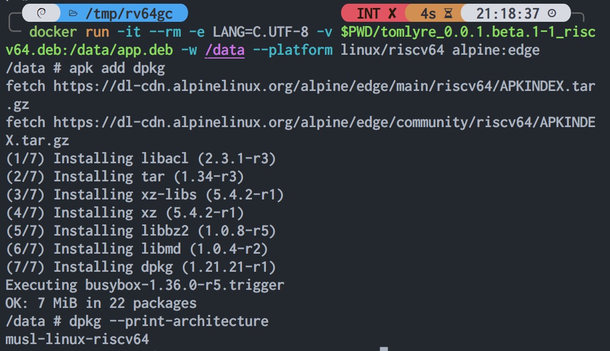
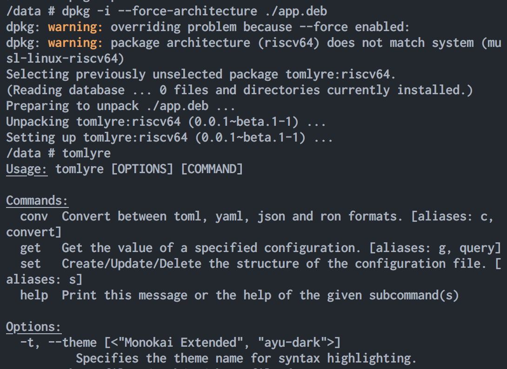
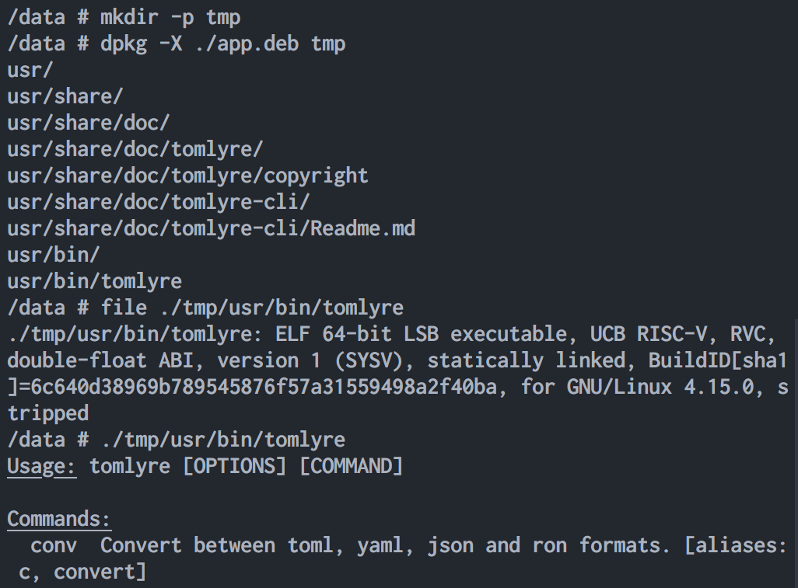
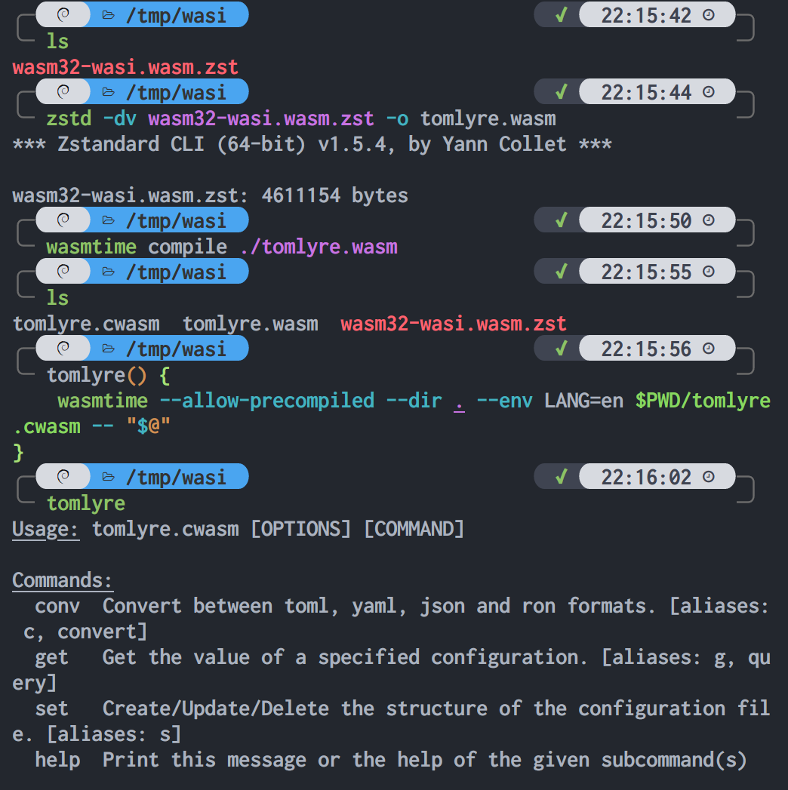
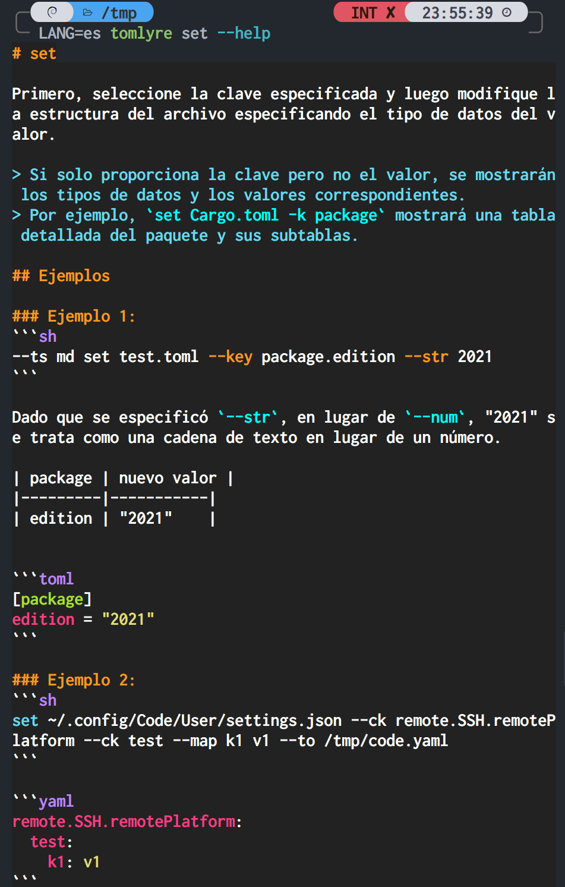

# TomLyre

library: [](https://crates.io/crates/tomlyre)

cli: [](https://crates.io/crates/tomlyre-cli)

[](https://docs.rs/tomlyre)

[](./License)

[中文](Readme-zh.md)

A tool for handling configuration files is available, with which you can explore toml, yaml, json, ron, bson, Lisp S-exp and xml freely and discover the fun in them.

By default, the bson & xml features are not enabled.

## Installation


First, click to open the SVG image, and then press the middle mouse button on the blue-highlighted hyperlink (e.g. "arm64.deb").
If you don't have a mouse, you can long-press on the touch screen and manually select "Open in new tab" to download it.

The above SVG will update automatically. If you cannot obtain the latest SVG due to browser cache, please go to Releases to obtain a fixed version of the SVG.

### Ubuntu

For **Ubuntu**, we can directly use `apt install [path/to/deb-file]` to install.

> If you do not have root privileges, you need to use elevation commands like `sudo` or `doas`.

Assuming the path to the deb file is `/app.deb`, the installation command would be `apt install /app.deb`.

<table>
  <tr>
    <td></td>
    <td></td>
  </tr>
</table>

### alpine

Let's try to see if Alpine can install .deb!

<table>
  <tr>
    <td></td>
    <td></td>
  </tr>
</table>

It is `musl-linux-riscv64`, not `riscv64`. It looks like it cannot be installed.

Let's force the installation and see.

<table>
  <tr>
    <td></td>
    <td></td>
  </tr>
</table>

> Q: Wow! That was amazing! Why did it work?

A: Because it was statically compiled.

> Sometimes, static compilation of glibc may cause problems. It is recommended to use static compilation of musl instead.

Considering that package managers in different distributions may conflict with each other, it is recommended to use `apk` on Alpine instead of Debian's `dpkg`.

<table>
  <tr>
    <td></td>
    <td>You can extract it and use it separately.</td>
  </tr>
</table>

### wasm

<table>
  <tr>
    <td></td>
    <td></td>
  </tr>
</table>

After downloading the `wasm.zst` file, it needs to be extracted.

Then, you need to obtain a runtime and let the runtime load this wasm file.

For example, you can use `wasmer`:

```sh
wasmer --dir . --env LANG=en ./tomlyre.wasm
```

Or you can use `wasmtime`:

```sh
wasmtime --dir . --env LANG=en ./tomlyre.wasm
```

Or any other runtimes you prefer.

### CI

If you need to use it in a Linux x64 CI environment, you can use the following command:

```sh
docker run -it --rm \
  -u $(id -u) \
  -v $PWD:/local \
  -w /data \
  ghcr.io/2moe/tomlyre:x86_64-unknown-linux-musl \
  cp tomlyre /local
```

This is equivalent to copying `/data/tomlyre` inside the container to the current directory.

### Others

For files with the `.tar.xz` or `.tar.bz2` suffix, we can use `tar -xvf [compressed-file]` to extract them.

```sh
tar -xvf x64.tar.xz
```

After extraction, call `./tomlyre` in the terminal to run.

## Features

The core features of this tool are only three:

1. Conversion (conv)
2. Getting (get)
3. Setting/modifying (set)

Everything else is an additional feature, like setting themes and table styles.

Use `--help` to get detailed help information.

- `tomlyre set` is equivalent to `tomlyre set -h`, which outputs concise help information.
- `tomlyre set --help` outputs very detailed information.
- Similarly, other subcommands can also call `--help`.

<table>
  <tr>
    <td><code>get --help</code></td>
    <td><code>conv --help</code></td>
  </tr>
</table>

It even supports L10n(localization/localisation) (with resources located in the **assets/l10n** directory).
Unfortunately, there are currently many translation errors. 😭

If you like it, anyone is welcome to improve the translation.

If you don't know how to do it, please feel free to submit an issue.

<table>
  <tr>
    <td style="text-align:center;">español(España)</td>
    <td style="text-align:center;">Deutsch(Deutschland)</td>
  </tr>
</table>

<table>
  <tr>
    <td style="text-align:center;">日本語</td>
    <td style="text-align:center;">العربية</td>
  </tr>
</table>

<table>
  <tr>
    <td style="text-align:center;">português(Brasil)</td>
    <td style="text-align:center;">français(France)</td>
  </tr>
</table>

### Theme

Use the `--theme` argument (can be abbreviated as `-t`) to specify a theme, for example `tomlyre -t "One Dark" conv test.yml -t json`.

> The `-t` of the `conv` subcommand refers to `--to`, while the `-t` of the root command is `--theme`.

When no theme name is specified, all themes will be listed.

The following are built-in themes, but you can also manually load a collection of themes and specify the name instead of using the built-in ones.

> Most of these themes use the MIT License, and you can find the built-in themes and related license files in the **assets/theme** directory.

<!-- 


 -->

<table>
  <tr>
    <td></td>
    <td></td>
  </tr>
</table>

<table>
  <tr>
      <td></td>
      <td></td>
  </tr>
</table>

<table>
  <tr>
    <td></td>
    <td></td>
  </tr>
</table>

### Table Styles

Use `--table-style` (can be abbreviated as `--ts`) to specify the table style. For example, `--table-style markdown` or `--ts md` can be used to specify the table style as markdown.

```sh
tomlyre --ts md get Cargo.toml -k profile.fat
```

| profile.fat | Type | Value |
| ----------- | ---- | ----- |
| inherits    | str  | thin  |
| lto         | str  | fat   |
| opt-level   | str  | z     |

The following are built-in table styles:
(Non-monospace fonts may cause layout issues.)

```plaintext

style: default

╭─────────┬──────────┬────────────╮
│ Version ┆ Codename ┆ Created    │
├─────────┼──────────┼────────────┤
│ 10      ┆ Buster   ┆ 2017-06-17 │
├╌╌╌╌╌╌╌╌╌┼╌╌╌╌╌╌╌╌╌╌┼╌╌╌╌╌╌╌╌╌╌╌╌┤
│ 11      ┆ Bullseye ┆ 2019-07-16 │
├╌╌╌╌╌╌╌╌╌┼╌╌╌╌╌╌╌╌╌╌┼╌╌╌╌╌╌╌╌╌╌╌╌┤
│ 12      ┆ Bookworm ┆ 2021-08-14 │
├╌╌╌╌╌╌╌╌╌┼╌╌╌╌╌╌╌╌╌╌┼╌╌╌╌╌╌╌╌╌╌╌╌┤
│ 13      ┆ Trixie   ┆ 2023       │
├╌╌╌╌╌╌╌╌╌┼╌╌╌╌╌╌╌╌╌╌┼╌╌╌╌╌╌╌╌╌╌╌╌┤
│ 14      ┆ Forky    ┆ 2025       │
╰─────────┴──────────┴────────────╯


style: nothing

 Version  Codename  Created
 10       Buster    2017-06-17
 11       Bullseye  2019-07-16
 12       Bookworm  2021-08-14
 13       Trixie    2023
 14       Forky     2025


style: ascii

+---------+----------+------------+
| Version | Codename | Created    |
+=================================+
| 10      | Buster   | 2017-06-17 |
|---------+----------+------------|
| 11      | Bullseye | 2019-07-16 |
|---------+----------+------------|
| 12      | Bookworm | 2021-08-14 |
|---------+----------+------------|
| 13      | Trixie   | 2023       |
|---------+----------+------------|
| 14      | Forky    | 2025       |
+---------+----------+------------+


style: ascii-borders

+---------------------------------+
| Version   Codename   Created    |
+=================================+
| 10        Buster     2017-06-17 |
| 11        Bullseye   2019-07-16 |
| 12        Bookworm   2021-08-14 |
| 13        Trixie     2023       |
| 14        Forky      2025       |
+---------------------------------+


style: right-u8-fat

┌─────────┬──────────┬────────────┐
│ Version │ Codename │ Created    │
╞═════════╪══════════╪════════════╡
│ 10      │ Buster   │ 2017-06-17 │
├─────────┼──────────┼────────────┤
│ 11      │ Bullseye │ 2019-07-16 │
├─────────┼──────────┼────────────┤
│ 12      │ Bookworm │ 2021-08-14 │
├─────────┼──────────┼────────────┤
│ 13      │ Trixie   │ 2023       │
├─────────┼──────────┼────────────┤
│ 14      │ Forky    │ 2025       │
└─────────┴──────────┴────────────┘


style: right-u8

┌─────────┬──────────┬────────────┐
│ Version │ Codename │ Created    │
├─────────┼──────────┼────────────┤
│ 10      │ Buster   │ 2017-06-17 │
├─────────┼──────────┼────────────┤
│ 11      │ Bullseye │ 2019-07-16 │
├─────────┼──────────┼────────────┤
│ 12      │ Bookworm │ 2021-08-14 │
├─────────┼──────────┼────────────┤
│ 13      │ Trixie   │ 2023       │
├─────────┼──────────┼────────────┤
│ 14      │ Forky    │ 2025       │
└─────────┴──────────┴────────────┘


style: right-u8-thin

┌─────────┬──────────┬────────────┐
│ Version ┆ Codename ┆ Created    │
├─────────┼──────────┼────────────┤
│ 10      ┆ Buster   ┆ 2017-06-17 │
├╌╌╌╌╌╌╌╌╌┼╌╌╌╌╌╌╌╌╌╌┼╌╌╌╌╌╌╌╌╌╌╌╌┤
│ 11      ┆ Bullseye ┆ 2019-07-16 │
├╌╌╌╌╌╌╌╌╌┼╌╌╌╌╌╌╌╌╌╌┼╌╌╌╌╌╌╌╌╌╌╌╌┤
│ 12      ┆ Bookworm ┆ 2021-08-14 │
├╌╌╌╌╌╌╌╌╌┼╌╌╌╌╌╌╌╌╌╌┼╌╌╌╌╌╌╌╌╌╌╌╌┤
│ 13      ┆ Trixie   ┆ 2023       │
├╌╌╌╌╌╌╌╌╌┼╌╌╌╌╌╌╌╌╌╌┼╌╌╌╌╌╌╌╌╌╌╌╌┤
│ 14      ┆ Forky    ┆ 2025       │
└─────────┴──────────┴────────────┘


style: u8

┌─────────┬──────────┬────────────┐
│ Version ┆ Codename ┆ Created    │
╞═════════╪══════════╪════════════╡
│ 10      ┆ Buster   ┆ 2017-06-17 │
├╌╌╌╌╌╌╌╌╌┼╌╌╌╌╌╌╌╌╌╌┼╌╌╌╌╌╌╌╌╌╌╌╌┤
│ 11      ┆ Bullseye ┆ 2019-07-16 │
├╌╌╌╌╌╌╌╌╌┼╌╌╌╌╌╌╌╌╌╌┼╌╌╌╌╌╌╌╌╌╌╌╌┤
│ 12      ┆ Bookworm ┆ 2021-08-14 │
├╌╌╌╌╌╌╌╌╌┼╌╌╌╌╌╌╌╌╌╌┼╌╌╌╌╌╌╌╌╌╌╌╌┤
│ 13      ┆ Trixie   ┆ 2023       │
├╌╌╌╌╌╌╌╌╌┼╌╌╌╌╌╌╌╌╌╌┼╌╌╌╌╌╌╌╌╌╌╌╌┤
│ 14      ┆ Forky    ┆ 2025       │
└─────────┴──────────┴────────────┘


style: u8-no-dividers

┌─────────┬──────────┬────────────┐
│ Version ┆ Codename ┆ Created    │
╞═════════╪══════════╪════════════╡
│ 10      ┆ Buster   ┆ 2017-06-17 │
│ 11      ┆ Bullseye ┆ 2019-07-16 │
│ 12      ┆ Bookworm ┆ 2021-08-14 │
│ 13      ┆ Trixie   ┆ 2023       │
│ 14      ┆ Forky    ┆ 2025       │
└─────────┴──────────┴────────────┘


style: u8-borders

┌─────────────────────────────────┐
│ Version   Codename   Created    │
╞═════════════════════════════════╡
│ 10        Buster     2017-06-17 │
│ 11        Bullseye   2019-07-16 │
│ 12        Bookworm   2021-08-14 │
│ 13        Trixie     2023       │
│ 14        Forky      2025       │
└─────────────────────────────────┘


style: u8-no-borders

 Version ┆ Codename ┆ Created
═════════╪══════════╪════════════
 10      ┆ Buster   ┆ 2017-06-17
╌╌╌╌╌╌╌╌╌┼╌╌╌╌╌╌╌╌╌╌┼╌╌╌╌╌╌╌╌╌╌╌╌
 11      ┆ Bullseye ┆ 2019-07-16
╌╌╌╌╌╌╌╌╌┼╌╌╌╌╌╌╌╌╌╌┼╌╌╌╌╌╌╌╌╌╌╌╌
 12      ┆ Bookworm ┆ 2021-08-14
╌╌╌╌╌╌╌╌╌┼╌╌╌╌╌╌╌╌╌╌┼╌╌╌╌╌╌╌╌╌╌╌╌
 13      ┆ Trixie   ┆ 2023
╌╌╌╌╌╌╌╌╌┼╌╌╌╌╌╌╌╌╌╌┼╌╌╌╌╌╌╌╌╌╌╌╌
 14      ┆ Forky    ┆ 2025


style: horizontal

---------------------------------
 Version   Codename   Created
=================================
 10        Buster     2017-06-17
---------------------------------
 11        Bullseye   2019-07-16
---------------------------------
 12        Bookworm   2021-08-14
---------------------------------
 13        Trixie     2023
---------------------------------
 14        Forky      2025
---------------------------------


style: round-u8

╭─────────┬──────────┬────────────╮
│ Version │ Codename │ Created    │
├─────────┼──────────┼────────────┤
│ 10      │ Buster   │ 2017-06-17 │
├─────────┼──────────┼────────────┤
│ 11      │ Bullseye │ 2019-07-16 │
├─────────┼──────────┼────────────┤
│ 12      │ Bookworm │ 2021-08-14 │
├─────────┼──────────┼────────────┤
│ 13      │ Trixie   │ 2023       │
├─────────┼──────────┼────────────┤
│ 14      │ Forky    │ 2025       │
╰─────────┴──────────┴────────────╯


style: round-u8-fat

╭─────────┬──────────┬────────────╮
│ Version ┆ Codename ┆ Created    │
╞═════════╪══════════╪════════════╡
│ 10      ┆ Buster   ┆ 2017-06-17 │
├╌╌╌╌╌╌╌╌╌┼╌╌╌╌╌╌╌╌╌╌┼╌╌╌╌╌╌╌╌╌╌╌╌┤
│ 11      ┆ Bullseye ┆ 2019-07-16 │
├╌╌╌╌╌╌╌╌╌┼╌╌╌╌╌╌╌╌╌╌┼╌╌╌╌╌╌╌╌╌╌╌╌┤
│ 12      ┆ Bookworm ┆ 2021-08-14 │
├╌╌╌╌╌╌╌╌╌┼╌╌╌╌╌╌╌╌╌╌┼╌╌╌╌╌╌╌╌╌╌╌╌┤
│ 13      ┆ Trixie   ┆ 2023       │
├╌╌╌╌╌╌╌╌╌┼╌╌╌╌╌╌╌╌╌╌┼╌╌╌╌╌╌╌╌╌╌╌╌┤
│ 14      ┆ Forky    ┆ 2025       │
╰─────────┴──────────┴────────────╯


style: markdown

| Version | Codename | Created    |
|---------|----------|------------|
| 10      | Buster   | 2017-06-17 |
| 11      | Bullseye | 2019-07-16 |
| 12      | Bookworm | 2021-08-14 |
| 13      | Trixie   | 2023       |
| 14      | Forky    | 2025       |
```

### conv

Warning: If the data types between two configurations are not fully compatible, the data type will change after conversion.

---

For example, ron has a `char` type, which represents a single character.

Take `hello, 世界` as an example. This is a string.
'h' is char, "h" is string.
"世界" is string, '世' is char.

However, both `json 1.0` and `toml 1.0` do not have a `char` type.

hello.ron:

```ron
{
   "s": '世',
   "j": '界',
}
```

```sh
tomlyre c hello.ron -t json
```

json:

```json
{
  "j": "界",
  "s": "世"
}
```

Therefore, converting a `char` from `ron` to `json 1.0` will result in a string.

---

For example, currently many configuration formats support two special floating-point numbers: **NaN** and **inf**, but `json 1.0` does not support them.

In `json 1.0`, they will both become `null`.

f64-map.toml:

```toml
[double-float-map]
not-a-num = nan
infinity = inf
```

```sh
tomlyre conv f64-map.toml -t ./f.yaml --save
```

f.yaml:

```yaml
double-float-map:
  infinity: .inf
  not-a-num: .nan
```

```sh
tomlyre conv f.yaml -t ron --sv
```

f.ron:

```ron
{
    "double-float-map": {
        "infinity": inf,
        "not-a-num": NaN,
    },
}
```

```sh
tomlyre conv f.ron -t sexp
```

> sexp refers to Lisp S-Expressions.

```lisp
(("double-float-map" ("infinity" . inf) ("not-a-num" . NaN)))
```

```sh
tomlyre conv f.ron -t json
```

```json
{
  "double-float-map": {
    "infinity": null,
    "not-a-num": null
  }
}
```

```sh
tomlyre conv f.ron -t json5
```

```json5
{ "double-float-map": { infinity: Infinity, "not-a-num": NaN } }
```

---

Q: What is the data type that `json` has but other formats do not have?

A: `null`

For example, `toml 1.0` and `ron` do not support `null` values. If you convert a `json 1.0` configuration containing `null`, `toml` will report an error directly, while `ron` will convert it to an empty tuple `()`, which is commonly known as the **Unit** type.

> Note: ron uses the `Option<T>` type, with a value of `Some(T)` or `None`, rather than `null`.

In addition, there are many differences between different configuration formats, and we have not listed them all.

### get and set

When you use the `set` subcommand to specify a key and do not specify a value, it is equivalent to a more detailed version of `set`.

For example, we use the following command to read and parse data from stdin:

> The `-` after `get` means that the source is stdin instead of a specific file

```sh
curl -sL https://raw.githubusercontent.com/2moe/tomlyre/main/Cargo.toml | tomlyre get -  -k profile.thin.strip
```

When using `get`, stdout will output `true`.

But when we change `get` to `set`, it will output:

```yaml
true

key:    ["profile", "thin", "strip"]
type:   boolean
value:
 true
```

> Q: Is it better to have more information in the output?

A: Not necessarily!  
This mainly depends on our intended use.  
When we need to get specific values with a script, only valid information is needed. Extra information is not only useless, but can also interfere with data retrieval.  
On the contrary, when we need to modify the data manually, having specific information is often better.

### set

We can use `--help` with the `set` subcommand to get detailed information.

The basic usage is: `set [source file] -k [keys separated by "."] [options for specifying data type] [value(s) for the specified data type (may be empty or multiple)]`

For example, `set test.toml --key package.edition --str 2024`.

---

> Note:  
> Only when the format of `src` is `toml` will the comments be preserved, otherwise they will not.
> Other formats will first be converted to `toml` before modification, and the converted file will not preserve comments.

---

Here are some of the data types that it supports:

Basic data types

| Option     | Alias          | Value Type          | Description                            | Example                     |
| ---------- | -------------- | ------------------- | -------------------------------------- | --------------------------- |
| -s         | --str          | String              | String type                            | `-s "1.114.5-beta.1"`       |
| -b         | --bool         | bool                | Boolean type                           | `-b true`                   |
| --f64      |                | f64                 | Double-precision float                 | `--f64 314e-2`              |
| -n         | --num/--int    | i64                 | 64-bit signed integer                  | `-n 2048`                   |
| -a         | --arr          | `Vec<String>`       | Array of strings                       | `-a hello -a world`         |
| --num-arr  | --na           | `Vec<i64>`          | Array of i64                           | `--na 11 --na -3`           |
| --f64-arr  | --fa           | `Vec<f64>`          | Array of double-precision floats       | `--fa 3.14 --fa 2.71828182` |
| --bool-arr | --ba           | `Vec<bool>`         | Array of boolean                       | `--ba true --ba false`      |
| -i         | --inline-table | `Vec<(key, value)>` | Inline table                           | `-i name sd -i os android`  |
| --rm       |                |                     | Delete the specified key and its value |                             |

In addition, there are some data types that are not as "basic", such as "standard table", "table array", and DateTime.

The standard table is very similar to the inline table. If you don't know which one to use, use inline table(`-i`) instead of standard table(`-m`).

For formats other than **toml**, use `-i` to create a new table instead of `-m`!

Suppose that in `hello.toml`, there is a table array named `test`, and the map at index 0 has a key named `kk` with a value of `v`.

```toml
[[test]]
kk = "v"
```

```sh
set hello.toml -k test.
```

| test. | Type | Value |
| ----- | ---- | ----- |
| 0.kk  | str  | v     |

```yaml
key:    ["test"]
type:   array of tables
value:
[{ kk = "v" }]
```

Let's create a sub-table using `-m` or `--table`.

```sh
set hello.toml --key test.0.a --map hello world --pre
```

Output:

```yaml
key: ["test", "0", "a"]
type: table
new value: hello = "world"
```

| test.0  | Type | New Value |
| ------- | ---- | --------- |
| kk      | str  | v         |
| a.hello | str  | world     |

```toml
[[test]]
kk = "v"

[test.a]
hello = "world"
```

It looks like there is no problem. Let's try using an inline table.

```sh
set hello.toml -k test.0.a -i hello world --pre
```

Output:

```toml
[[test]]
kk = "v"
a = { hello = "world" }
```

For this case, the standard table and the inline table are the same. (Although they look different, their parsing results are the same.)

However, when the key is `test.0.x.y.z` and there are multiple nonexistent nested sub-tables inside, you can try using `-m` and `-i` separately.

After trying it out myself, I believe you will understand why not to use `-m`.

## Log Levels

The level of detail from high to low is `trace` > `debug` > `info` > `warn` > `error`.

`trace` is the most detailed.

The default level is `info`.

We can modify the log level by setting an environment variable:

```sh
env RUST_LOG=debug tomlyre
```

## Off-topic

### Original Design Intention

> Q: What was the original design intention of this tool?

A:
The original intention was to allow everyone to query and modify configuration files in a simple and elegant way in the CLI.

About a year or two ago, I mentioned in the documentation of another project:

- That project would subsequently use the `toml` format for configuration.
  - And introduced some specific details
    - Such as using the `get` subcommand to retrieve
    - Use `set` to modify

When designing, I was struggling with whether to use toml, yaml, ron, or go further and use a database directly.

At first, I had already written code that supports both toml and yaml at the same time.  
This involves the problem of parsing priority.  
When the following files exist at the same time, which one should the program parse first?

- cfg.toml
- cfg.Toml
- cfg.yaml
- cfg.yml
- cfg.YAML
- cfg.YML
- cfg.Yaml

At this point, there needs to be a core configuration to specify the user configuration.  
So the question is, what format should the core configuration be?  
We can use environment variables to specify the format of the core configuration.

It doesn't seem to be very difficult to look at it like this!

Note: different formats have different specifications, and compatibility with different formats requires an understanding of their differences.  
If you want to support more formats, it will become a bit cumbersome.

Some things are not very difficult in themselves, but they require a lot of time and effort to deal with.

In the end, I separated it into a separate small tool.

In this way, everyone can indirectly support multiple formats through this small tool. (What we see is yaml, but the actual modification is a toml file)

### yaml

> Q: Why support multiple configuration formats? Many people say that `yaml` is more readable. Can't we just support yaml?

Although I would like to firmly answer, "No!", it actually depends on the needs of you and your users.

**YAML** supports more advanced features than **TOML** and **JSON**, such as references, includes, and tags.

1. Anchor and Alias: Allows reusing the same data structure or node within the same document.
2. References: Allows referencing values from other nodes within a YAML document.
3. Custom Tags: Allows defining custom tags to better control the parsing of YAML data types.
4. Includes: Allows combining multiple YAML files into one file, improving code reusability.

If you need these features, then using **YAML** is an excellent choice.

If you don't need these features, is it worth choosing **YAML**?

This question is worth discussing.

> Pro-side: The more features, the better. I may not use them, but you can't be without them.
>
> Con-side: Too many features increase complexity and confusion.

In addition to balancing readability and functionality, the feelings of ordinary users should also be considered.

> If a configuration file contains complex nested structures, and your users do not have an "advanced" editor, then the indentation feature of **YAML** may easily lead to errors.

If your users may write configurations in `notepad` on early Windows, would **TOML** be better than **YAML**?

> Early refers to before 2022 on Windows 10, when `notepad.exe` only had basic functions.  
> Windows tools are constantly evolving, and perhaps one day `notepad` will also have advanced features such as syntax highlighting, displaying whitespace characters, and code completion. Therefore, I limited it to "early".

Taking Windows as an example may not be appropriate because there are many editor software.

Even if you find a kid on the street, he can easily help you install editor software.

So, we have turned the question into: "Hi, my environment is RISC-V architecture, uClibc Linux, with no package manager. Could you help me set up a cross-compiling environment on your computer? Then compile an ultra-lightweight editor, which needs syntax highlighting and can highlight whitespace characters."

Hmm, let's not make it too difficult for that kid.
